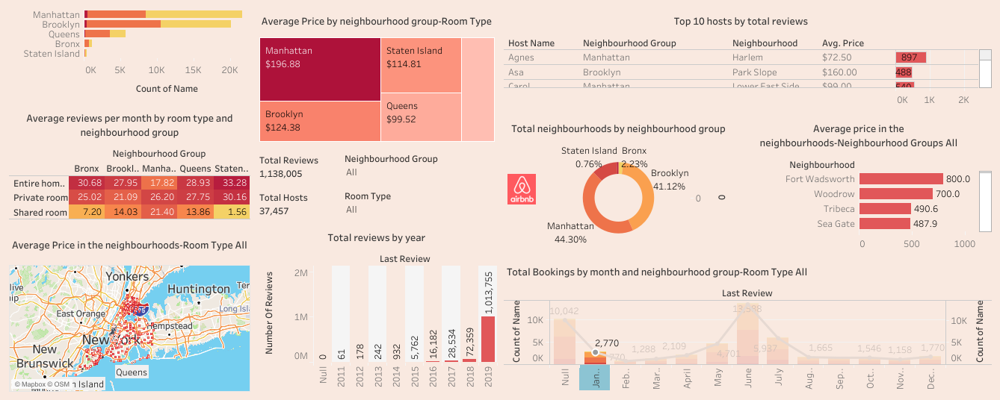

## 🏙️ Airbnb NYC Data Dashboard

This project features an interactive Tableau dashboard built using Airbnb listing data for New York City. It visualizes key insights including:

- Total Bookings by month and neighbourhood group-Room Type
- Average price in the neighbourhoods-Neighbourhood
- Top 10 hosts by total reviews
- Average pricing per room type
- Total neighbourhoods by neighbourhood group
- Average reviews per month by room type and neighbourhood group

## 🔧 Tools Used
- Tableau Public
- Excel (for data cleaning)

## 📊 View the Dashboard
[Click here to view on Tableau Public](https://public.tableau.com/app/profile/anushka.gupta2641/viz/AirbnbInNYC_AnushkaGupta/Dashboard2)

## 📬 Get in Touch

If you have feedback or questions, feel free to reach out or connect on [LinkedIn](https://linkedin.com/in/anushkagupta23).
